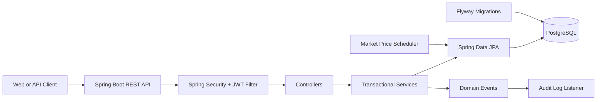

# Architecture

## Overview

FinCoreX is a stateless Spring Boot REST API backed by PostgreSQL. Authentication
is handled with signed JWT bearer tokens, while Flyway owns the database schema.

## Layers

### Controllers

Controllers expose the HTTP contract and apply request validation. They do not
perform financial calculations or access repositories directly.

- `AuthController`: registration and login
- `WalletController`: deposits, withdrawals, portfolio, transactions, and audits
- `TradeController`: BUY and SELL execution
- `AssetController`: authenticated asset listing
- `UserController`: admin-only user management
- `HealthController`: basic application health response

### Services

Services contain domain rules and transaction boundaries.

- Registration hashes passwords and creates a wallet through a domain event.
- Wallet mutations lock the wallet row before changing its balance.
- Trades lock the wallet, asset, and existing wallet-asset row before changing
  balances or quantities.
- SELL operations calculate realized P/L from the average buy price.
- Portfolio reads calculate current value and unrealized P/L from market prices.

### Persistence

Flyway migrations create and evolve the schema. Hibernate runs with
`ddl-auto: validate`, so application startup verifies that the entity model and
database schema agree without changing the schema implicitly.

Important database safeguards include:

- Unique user email
- One wallet per user
- One wallet-asset row per wallet and asset
- Non-negative wallet balances and asset quantities
- Positive transaction amounts and asset prices
- Indexes for wallet transaction and audit history lookups

## Financial Semantics

- Monetary amounts use two decimal places.
- Asset quantities and average buy prices use four decimal places.
- BUY uses the current asset price and decreases cash balance.
- SELL uses the current asset price, increases cash balance, and records realized
  profit or loss.
- Remaining positions use average cost for unrealized P/L.
- Market prices are simulated and updated on a configurable schedule.

## Security Model

- `/api/auth/**`, health endpoints, and OpenAPI endpoints are public according
  to configuration.
- `/api/users/**` requires the `ADMIN` role.
- Wallet and trade operations require authentication and verify wallet ownership.
- Passwords are stored as BCrypt hashes.
- The API is stateless and does not create server sessions.
- JWT secrets must be Base64-encoded and decode to at least 32 bytes.
- CORS origins are configured with `CORS_ALLOWED_ORIGINS`.

## Runtime Components

The default Compose stack contains:

- `app`: Spring Boot API on port `8080`
- `postgres`: PostgreSQL on the internal Compose network
- `pgadmin`: optional development tool enabled with the `tools` profile

The application exposes Actuator health at `/actuator/health`. PostgreSQL
readiness is included through Spring Boot health indicators.
